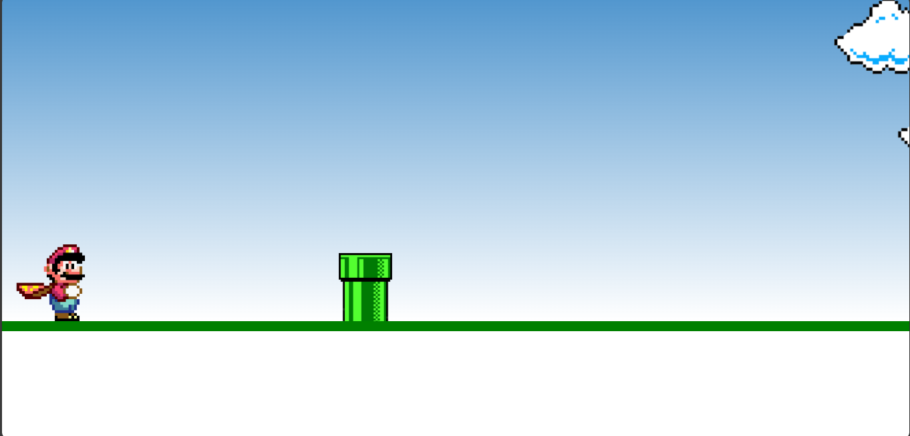

# Supermario-Javascript

Um mini-jogo inspirado no Super Mario, desenvolvido com HTML, CSS e JavaScript puro.

## Sobre o Projeto

Neste projeto, você controla o Mario e deve pular para desviar dos canos que se aproximam. O objetivo é sobreviver o máximo de tempo possível sem colidir com os obstáculos.

## Funcionalidades

- Mario pula ao pressionar qualquer tecla do teclado.
- O cano se move continuamente da direita para a esquerda.
- Detecção de colisão entre o Mario e o cano.
- Tela de game over quando ocorre a colisão.
- Animação de nuvens ao fundo para dar mais vida ao cenário.

## Estrutura dos Arquivos

```
.
├── Index.html           # Estrutura principal da página
├── css/
│   └── style.css        # Estilos e animações do jogo
├── img/
│   ├── clouds.png       # Imagem das nuvens
│   ├── game-over.png    # Imagem do Mario após colisão
│   ├── mario.gif        # Sprite animado do Mario
│   └── pipe.png         # Imagem do cano
└── js/
    └── script.js        # Lógica do jogo em JavaScript
```

## Tecnologias Utilizadas

- **HTML5:** Estrutura da página e elementos do jogo.
- **CSS3:** Estilização, posicionamento e animações (`@keyframes`) para o Mario, cano e nuvens.
- **JavaScript:** Lógica do jogo, detecção de colisão, controle de eventos de teclado e manipulação do DOM.

## Detalhes do Código

### HTML (`Index.html`)

- Contém a estrutura do jogo, incluindo a área do jogo (`.game-board`), imagens do Mario, cano e nuvens.
- Inclui os arquivos de estilo e script.

### CSS (`css/style.css`)

- Define o layout do cenário, posicionamento dos elementos e animações.
- Utiliza `@keyframes` para animar o cano e as nuvens.
- A classe `.jump` aplica a animação de pulo ao Mario.

### JavaScript (`js/script.js`)

- Seleciona os elementos do Mario e do cano.
- Adiciona um ouvinte de evento para detectar quando qualquer tecla é pressionada e faz o Mario pular.
- Usa `setInterval` para criar um loop de jogo que verifica constantemente a posição do Mario e do cano.
- Quando ocorre uma colisão, para as animações, troca a imagem do Mario para "game over" e encerra o loop.

#### Exemplo de detecção de colisão:
```javascript
if (pipePosition <= 120 && pipePosition > 0 && marioPosition < 80) {
    // Colisão detectada
    // Para as animações e exibe o game over
}
```

## Como Executar

1. Clone ou baixe este repositório.
2. Abra o arquivo `Index.html` em seu navegador.

## Créditos

- Imagens e sprites inspirados em Super Mario.
- Projeto desenvolvido para fins de estudo.

---

Divirta-se jogando!